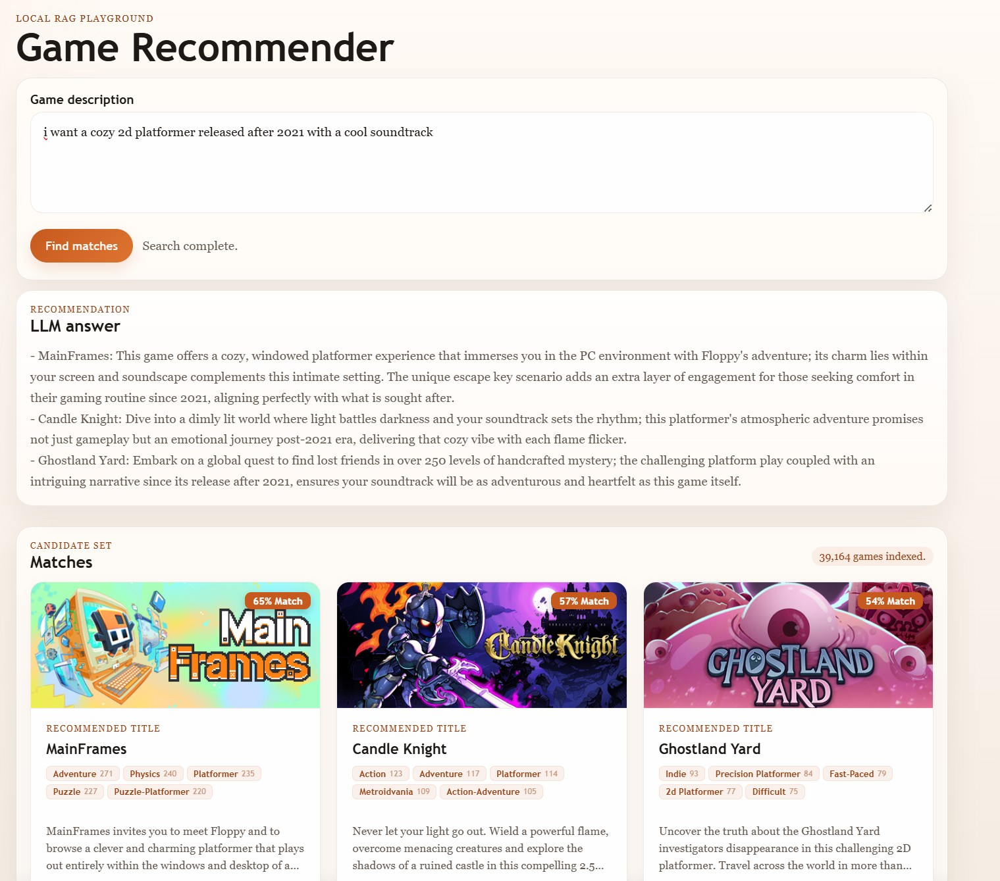

# Assignment 3: A Text Based Recommender System with LLMs

## Data

I have added the embedding files onto Google Drive which can be downloaded using this link (contains both files needed to run the app zipped together)  -

<a href="http://bit.ly/4nV4S9n">Download game\_appids\_v4.zip from Google Drive</a>

so that you can run the app directly after downloading them onto the same folder as the rest of the app files.

You will then be able to get the app running on http://127.0.0.1:5000/ with the following commands

cd rag

uv run flask --app app run --debug

Alternatively I have added the generate\_embeddings.py file which if you have the sqllite db in the folder ill create the embeddings for you locally to save you the effort of downloading it. The process of generating the embeddings has also been logged in the BDA-III notebook which will also help you create the v4 embeddings used in the final app.

